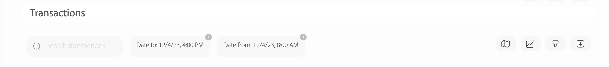

## Filteri

Korisniku tipa merchant administrator nakon prijave na sistem otvara se sljedeća stranica.

Primjena filtera se naslanja na pretraživanje transakcija. Izaberete koji dataset želite, i shodno tome, primjenite pretraživanje transakcija po datim filterima. U ovom slučaju filteri su po atributima date\_from i date\_to, te služe da se filtriraju transakcije od 08:00 do 16:00, kao što je prikazano na slici niže.

<figure><figcaption>
Slika 9: Prikaz primjenjivanja filtera
</figcaption></figure>

Filtere je moguće spasiti, za buduću upotrebu, klikom na treće dugme s lijeva. Ime filera ukucamo u prostor "_Filter name_", te klikom na dugme "_Save active filters" spašavamo filter,_ kao što je u ovom primjeru spašen filter _From8AMTo4PM._

<figure><figcaption>
Slika 10: Prikaz spašavanja fiitera.
</figcaption></figure>

Nakon primjene filtera, klikom na dugme export u desnom uglu izvještaj se generiše. \
Klikom na export dugme, dobijemo pop-up prozorčić gdje se unosi ime izvještaja, kao što je prikazano na slici niže.
