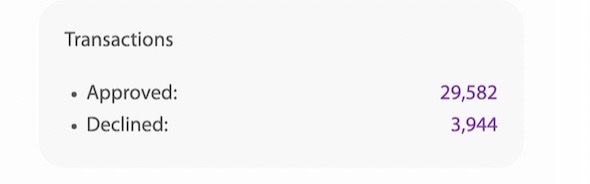
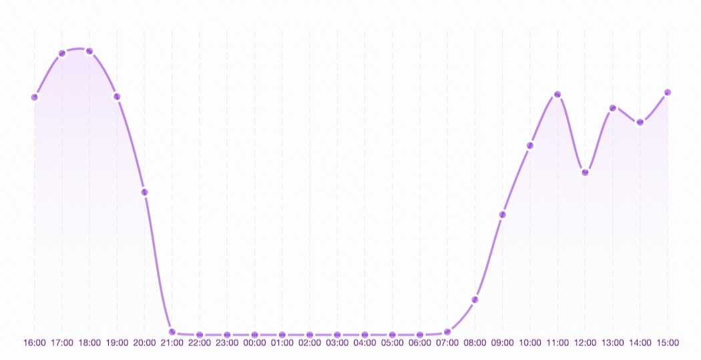
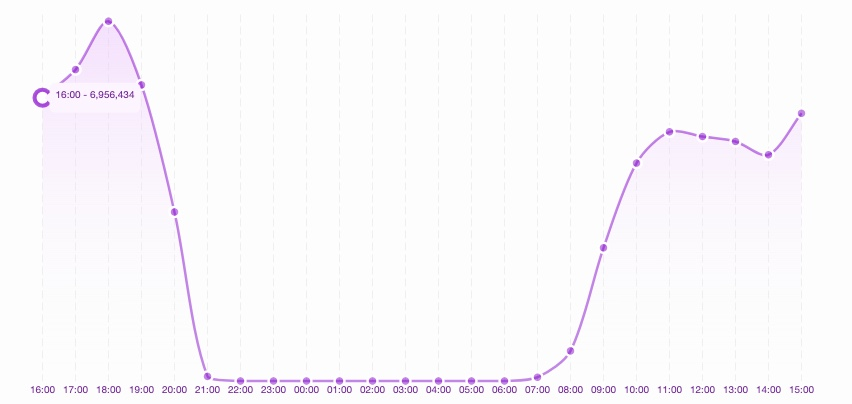

# Merchant Operator

Korisniku tipa merchant operator nakon prijave na sistem otvara se sljedeća stranica.

<figure><figcaption>
Slika 1: Izgled sučeja nakon prijave
</figcaption></figure>

Ova stranica predstavlja pregled stanja poslovanja trgovca.

U gornjem desnom uglu nalaze se tri ponuđena perioda, za koje je moguće izračunati i prikazati pregled stanja poslovanja trgovca.

Period se bira od strane korisnika. Ponuđene opcije su:

* _hourly_ (svakog sata zadnja 24 sata),
* _daily_ (svakog dana zadnjih 31 dana) te
* _monthly_ (svakog mjeseca zadnjih 12 mjeseci).

Na slici ispod prikazana su tri perioda. U ovo slučaju odabran je hourly.

<figure><figcaption>
Slika 2: Tri ponuđena perioda pregleda stanja
</figcaption></figure>

\
U desnoj strani prozora vidimo prikaz broja odobrenih i odbijenih transakcija trgovca, koje su izračunate za prethodno odabrani period - u ovom slučaju _hourly_.

<figure><figcaption>
Slika 3: Prikaz izračunatih odobrenih i odbijenih transakcija za odabrani period za trgovca
</figcaption></figure>

U gornjem dijelu prozora su prikazane tri kartice koje analiziraju stanje poslovanja trgovca. U pitanju su sljedeće vrste analize:&#x20;

* _Net sales_ (sumu transakcija),
* _Customers_ (broj korisnika) te
* _Transactions_ (broj transakcija) za odabrani period.

<figure><figcaption>
Slika 4: Prikaz tri stanja poslovanja trgovca
</figcaption></figure>

Nakon klika na NetSales generiše se graf predstavljen na slici niže. Graf se proseže kroz zadnja 24 sata - jer je odabran period _hourly_. Print scr je generisan u 16:55 sati. Prikaz će se generisati od prvog punog prošlog sata, pa unazad 24 sata. Zbog toga je, u ovom slučaju, prva tačka grafa 16:00, a zadnja 15:00.&#x20;

<figure><figcaption>
Slika 5: Prikaz grafa sume transakcija u posljednja 24 sata za trgovca
</figcaption></figure>

\
Tačke na grafu prikazuju vrijednosti sume transakcija u zadnjih sat vremena, a kurvatura grafa opisuje trendove i tok sume transakcija za trgovca. Prikaz na tački se dobiva prelaskom miša preko tačke. Na slici niže, prikazana je tačka na samom početku grafa. Ta tačka prikazuje vrijednost sume transakcije u posljednjih sat vremena odnosno od 15:00 do 16:00.

<figure><figcaption>
Slika 6: Prikaz izgleda nakon hover-a nad tačkom na grafu
</figcaption></figure>

<figure><figcaption>
Slika
</figcaption></figure>

Klikom na Transactions tab u lijevom meniju, otvara se pregled transakcija trgovca.

Atributi transakcija koji su prikazani su:

* id (jedinstveni redni broj transakcije),
* type (tip transakcije),
* date (datum trasnakcije),
* masked pan (maskirni broj kartice),
* amount (iznos transakcije u eurima) te
* status (status transakcije).

<figure><figcaption>
Slika: Prikaz transakcija
</figcaption></figure>

Klikom na id trasnakcije, otvara se detaljni prikaz transkcije, kao što je prikazano na slici ispod.

U detaljnom prikazu transakcije prikazane su informacije o: payment details, payment method, additional info, custom attributes i mapa nastanka transakcije.

<figure><figcaption></figcaption></figure>

 

<figure><figcaption></figcaption></figure>

 

<figure><figcaption></figcaption></figure>

Transakcije se mogu pretraživati koristeći search polje iznad tabelarnog prikaza. Polja po kojima se pretraga može vršiti su: id, tid, mid, amount, status, cc\_brand, cc\_issuer, currency, terminal, merhcant, acquirer, amount\_to, date\_from, date\_to, installments, approval\_code, response\_code, merchant\_name, card\_data\_entry, transaction\_type.

<figure><figcaption>
Slika: Prikaz polja za pretragu transakcije
</figcaption></figure>

Moguće je izvršiti i export/izvoz transakcija. U pitanju je CSV izvještaj detaljnih podataka odabranih transakcija za trgovca. Prije izrade exporta, možete odabrati filtere koje želite primijeniti kako biste odabrali željene transakcije u izvještaju.

Primjena filtera se naslanja na pretraživanje transakcija. Izaberete koji dataset želite, i shodno tome, primjenite pretraživanje transakcija po datim filterima. U ovom slučaju filteri su po atributima date\_from i date\_to, te služe da se filtriraju transakcije od 08:00 do 16:00, kao što je prikazano na slici niže.

<figure><figcaption>
Slika 9: Prikaz primjenjivanja filtera
</figcaption></figure>

Nakon primjene filtera, klikom na dugme export u desnom uglu izvještaj se generiše. \
Klikom na export dugme, dobijemo pop-up prozorčić gdje se unosi ime izvještaja, kao što je prikazano na slici niže.

Klikom na dugme submit, izvještaj je poslan na generiranje, a na prozoru se prikazuje poruka sa obavještenjem da će poruka o gotovom izvještaju biti dostavljena na e-mail, kao što je prikazano na slici ispod.

Klikom na Reports tab na meniju desno, otvara se prikaz svih izvještaja za trgovca, kao na slici niže.

Report/Izvještaj ima prikaz sljedećih kolona: Id, Created at, Name, From, To, File size, Status i Downloaded.

Na slici niže vidimo prikaz Izvještaja nakon što je generiran. Veličina datoteke je sada vidljiva, status je pomjeren iz generating u generated - dakle izvještaj je uspješno generiran.

Također je opcija download sada jasno prikazana, te se izvještaj preuzeti nakon što je uspješn generiran. Izvještaj će uvijek biti dostupan da ponovno skidanje.

//klik na id reporta sta se dobije? //prikaz nekog reporta u csv??
