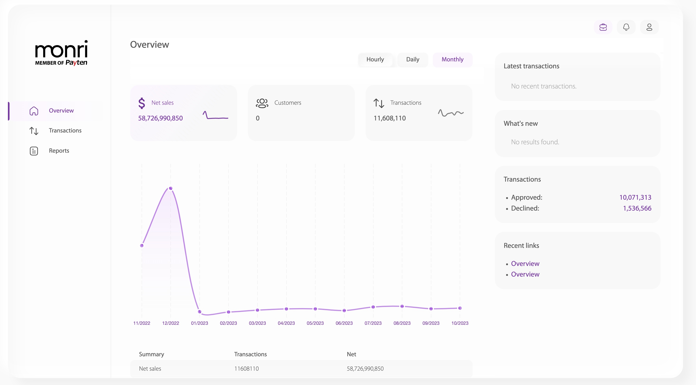
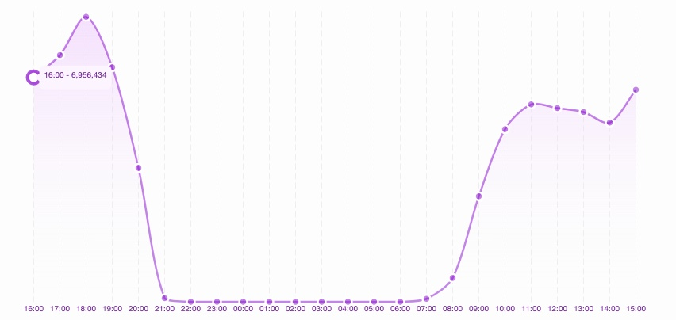

# Merchant Operator

Korisniku tipa merchant operator nakon prijave na sistem otvara se sljedeća stranica.

<figure><figcaption>
Slika 1: Izgled sučelj nakon prijave
</figcaption></figure>

Ova stranica predstavlja pregled stanja poslovanja trgovca.

U gornjem desnom uglu nalaze se tri ponuđena perioda, za koje je moguće izračunati i prikazati pregled stanja poslovanja trgovca.

Period se bira od strane korisnika. Ponuđene opcije su:

* _hourly_ (svakog sata zadnja 24 sata),
* _daily_ (svakog dana zadnjih 31 dana) te
* _monthly_ (svakog mjeseca zadnjih 12 mjeseci).

Na slici ispod prikazana su tri perioda. U ovo slučaju odabran je hourly.

<figure><figcaption>
Slika 2: Tri ponuđena perioda pregleda stanja
</figcaption></figure>

\
U desnoj strani prozora vidimo prikaz broja odobrenih i odbijenih transakcija trgovca, koje su izračunate za prethodno odabrani period - u ovom slučaju _hourly_.

<figure><figcaption>
Slika 3: Prikaz izračunatih odobrenih i odbijenih transakcija za odabrani period za trgovca
</figcaption></figure>

U gornjem dijelu prozora su prikazane tri kartice koje analiziraju stanje poslovanja trgovca. U pitanju su sljedeće vrste analize:

* _Net sales_ (sumu transakcija),
* _Customers_ (broj korisnika) te
* _Transactions_ (broj transakcija) za odabrani period.

<figure><figcaption>
Slika 4: Prikaz tri stanja poslovanja trgovca
</figcaption></figure>

Nakon klika na NetSales generiše se graf predstavljen na slici niže. Graf se proseže kroz zadnja 24 sata - jer je odabran period _hourly_. Print scr je generisan u 16:55 sati. Prikaz će se generisati od prvog punog prošlog sata, pa unazad 24 sata. Zbog toga je, u ovom slučaju, prva tačka grafa 16:00, a zadnja 15:00.

<figure><figcaption></figcaption></figure>

<figure><figcaption></figcaption></figure>

Klikom na Transactions tab u lijevom meniju, otvara se pregled transakcija trgovca.

<figure><figcaption>
Slika 5: Prikaz grafa sume transakcija u posljednja 24 sata za trgovca
</figcaption></figure>

\
Tačke na grafu prikazuju vrijednosti sume transakcija u zadnjih sat vremena, a kurvatura grafa opisuje trendove i tok sume transakcija za trgovca. Prikaz na tački se dobiva prelaskom miša preko tačke. Na slici niže, prikazana je tačka na samom početku grafa. Ta tačka prikazuje vrijednost sume transakcije u posljednjih sat vremena odnosno od 15:00 do 16:00.

<figure><figcaption>
Slika 6: Prikaz izgleda nakon hover-a nad tačkom na grafu
</figcaption></figure>

<figure><figcaption>
Slika
</figcaption></figure>
