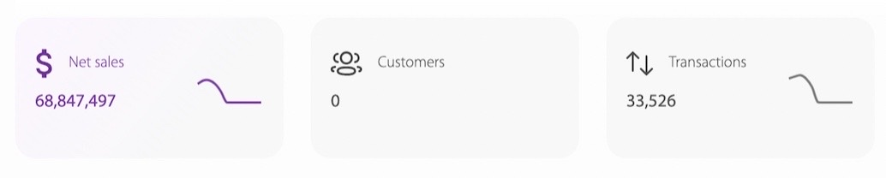
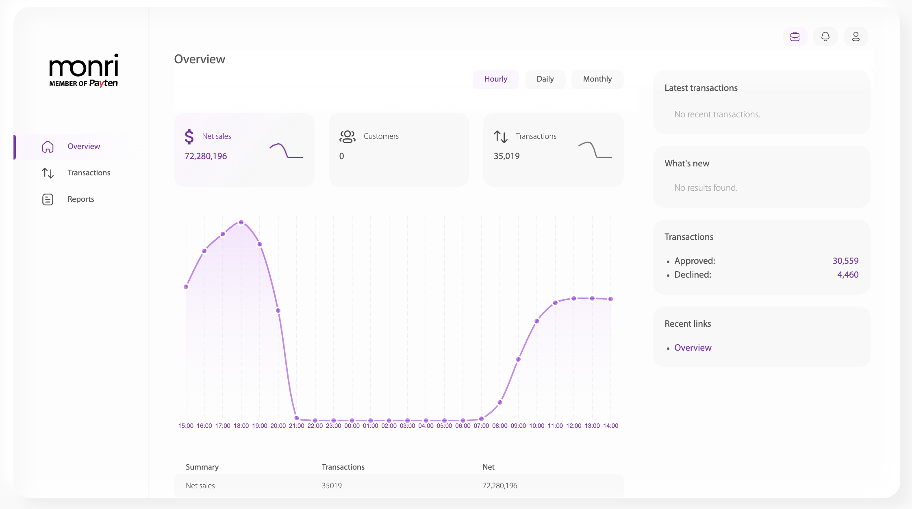
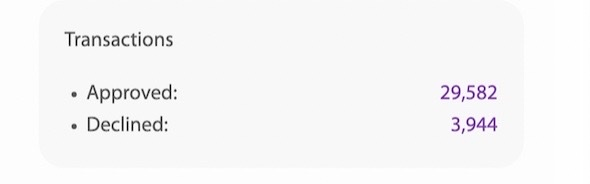

# Overview

Ova stranica predstavlja pregled stanja poslovanja trgovca čiji je uposlenik ulogovani korisnik.

U gornjem  dijelu stranice nalaze se tri ponuđena perioda, za koje je moguće izračunati i prikazati pregled stanja poslovanja trgovca.

Period se bira od strane korisnika. Ponuđene opcije su:

* _hourly_ (svakog sata zadnja 24 sata),
* _daily_ (svakog dana zadnjih 31 dana) te
* _monthly_ (svakog mjeseca zadnjih 12 mjeseci).

Na slici ispod prikazana su opisana tri perioda. U ovo slučaju odabran je hourly _(označen ljubičastom bojom)_.

<figure><figcaption>
Slika 2: Tri ponuđena perioda pregleda stanja
</figcaption></figure>

U dijelu prozora ispod spomenutih perioda su prikazane tri kartice koje analiziraju stanje poslovanja trgovca. U pitanju su sljedeće vrste analize:

* _Net sales_ (sumu transakcija),
* _Customers_ (broj korisnika) te
* _Transactions_ (broj transakcija) za odabrani period.

<figure><figcaption>
Slika 3: Prikaz tri stanja poslovanja trgovca
</figcaption></figure>

Koristeći kombinacije tri perioda i tri metrike poslovanja trgovca, korisnik može da napravi 9 kombinacija koje mu pružaju uvid u poslovanje. Za svaki period (dnevni, mjesečni i godišnji) može se izvršiti prikaz sume transakcije, broja korisnika te broja transakcija za taj period. Klikom bilo koje od tih 9 kombinacija, vrši se brza kalkulacija i rezultati bivaju prikazani kroz graf na sredini početnog ekrana.

Graf je predstavljen kao kriva koja se proseže koroz 2 ose: horizonatalna i vertikalna osa. \
Vertikalna osa prikazuje intenzitet/kvantitet odabranog stanja poslovanja - npr. ukoliko je odabrana suma transakcija, visina krive grafa će ukazivati na opadanje ili rast volumena zbirnog iznosa transakcija, a ukoliko je odabran broj transakcija visina krive grafa će ukazivati na opadanje ili rast broja transakcija. \
Horizontalna osa predstvlja vremenski period unutar kojeg se gleda vrijednost poslovanja trgovca. Ukoliko je odabran:

* hourly - na horizontalnoj osi će biti predstavljene 24 tačke koje predstavljaju okrugle sate krenuvši od prvog cijelog prošlog sata, u formatu HH:00.
* daily - na horizontalnoj osi će biti predstavljene tačke koje se odnose na svaki treći dan krenuvši od cijelog prošlog dana, pa unazad 31 dan,  u formatu dd/mm/yyyy.
* yearly - na horizontalnoj osi će biti predstavljeno 12 tačaka koje se odnose na svaki mjesec  krenuvši od cijelog prošlog mjeseca, u formatu mm/yyyy.

U nastavku će biti analizirana i prikazana metrika sume transakcija za sva tri perioda. Preostale dvije metrike se analiziraju na isti način.&#x20;

* **Suma transakcija na dnevnom nivou**

Nakon klika na NetSales generiše se graf predstavljen na slici niže. Graf se proseže kroz zadnja 24 sata - jer je odabran period _hourly_. Snimak ekrana je generisan u 15:40 sati. Prikaz će se generisati od prvog punog prošlog sata, pa unazad 24 sata. Zbog toga je, u ovom slučaju, prva tačka grafa 14:00, a zadnja 13:00.

<figure><figcaption>
Slika 4: Prikaz sume transakcija po dnevnom periodu
</figcaption></figure>

Tačke na grafu prikazuju vrijednosti sume transakcija u zadnjih sat vremena, a kurvatura grafa opisuje trendove i tok sume transakcija za trgovca.

Prikaz na tački se dobiva prelaskom miša preko tačke. Na slici niže, prikazana je tačka koja predstavlja vrijednost sume transakcija nastalih u sat vremena od 10:00 do 11:00 sati.

<figure><figcaption>
Slika 5: Prikaz vrijednosti sume transakcije u jednoj tački na grafu
</figcaption></figure>

* **Suma transakcija na mjesečnom nivou**

Nakon klika na NetSales generiše se graf predstavljen na slici niže. Graf se proseže kroz zadnjih 31 dan - jer je odabran period _daily_. Snimak ekrana je generisan 09.02i. Prikaz će se generisati od prvog punog prošlog dana, pa unazad 31 dan. Zbog toga je, u ovom slučaju, prva tačka grafa 09/01/2024, a zadnja 08/02/2024.

<figure><figcaption>
Slika 6: Prikaz sume transakcija po mjesečnom periodu
</figcaption></figure>

Tačke na grafu prikazuju vrijednosti sume transakcija u zadnjih sat vremena, a kurvatura grafa opisuje trendove i tok sume transakcija za trgovca.

Prikaz na tački se dobiva prelaskom miša preko tačke. Na slici niže, prikazana je tačka koja predstavlja vrijednost sume transakcija nastalih na dan 26/01/2024.

<figure><figcaption>
Slika 7: Prikaz vrijednosti sume transakcije u jednoj tački na grafu
</figcaption></figure>

* **Suma transakcija na godišnjem nivou**

Nakon klika na NetSales generiše se graf predstavljen na slici niže. Graf se proseže kroz zadnjih 31 dan - jer je odabran period _daily_. Snimak ekrana je generisan 09.02i. Prikaz će se generisati od prvog punog prošlog dana, pa unazad 31 dan. Zbog toga je, u ovom slučaju, prva tačka grafa 09/01/2024, a zadnja 08/02/2024.

<figure><figcaption>
Slika 8: Prikaz sume transakcija po godišnjem periodu
</figcaption></figure>

Tačke na grafu prikazuju vrijednosti sume transakcija u zadnjih sat vremena, a kurvatura grafa opisuje trendove i tok sume transakcija za trgovca.

Prikaz na tački se dobiva prelaskom miša preko tačke. Na slici niže, prikazana je tačka koja predstavlja vrijednost sume transakcija nastalih u 12 mjesecu 2023. godine.

<figure><figcaption>
Slika 9: Prikaz vrijednosti sume transakcije u jednoj tački na grafu
</figcaption></figure>

U desnoj strani prozora vidimo prikaz broja odobrenih i odbijenih transakcija trgovca, koje su izračunate za prethodno odabrani period - u ovom slučaju _hourly_.

<figure><figcaption>
Slika 10: Prikaz izračunatih odobrenih i odbijenih transakcija za odabrani period za trgovca
</figcaption></figure>
