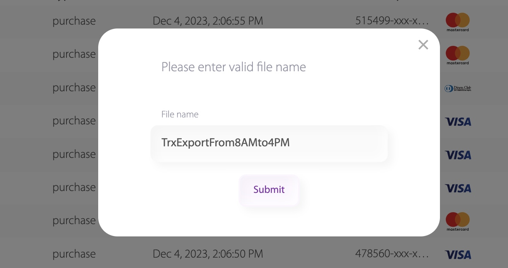
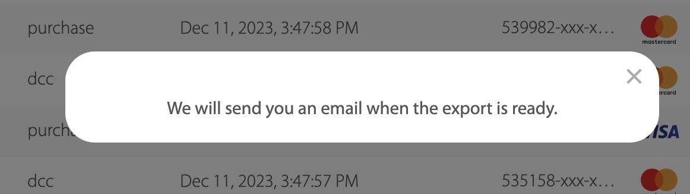

# Reports

Moguće je izvršiti i export/izvoz transakcija. U pitanju je CSV izvještaj detaljnih podataka odabranih transakcija za trgovca. Prije izrade exporta, možete odabrati filtere koje želite primijeniti kako biste odabrali željene transakcije u izvještaju.

Primjena filtera se naslanja na pretraživanje transakcija. Izaberete koji dataset želite, i shodno tome, primjenite pretraživanje transakcija po datim filterima. U ovom slučaju filteri su po atributima date\_from i date\_to, te služe da se filtriraju transakcije od 08:00 do 16:00, kao što je prikazano na slici niže.

Nakon primjene filtera, klikom na dugme export u desnom uglu izvještaj se generiše.\
Klikom na export dugme, dobijemo pop-up prozorčić gdje se unosi ime izvještaja, kao što je prikazano na slici niže.

<figure><figcaption>
Slika 9: Prikaz primjene filtera i dugma export
</figcaption></figure>

<figure><figcaption>
Slika 10: prikaz pop-up pozorčića za unos imena reporta
</figcaption></figure>

Klikom na dugme submit, izvještaj je poslan na generiranje, a na prozoru se prikazuje poruka sa obavještenjem da će poruka o gotovom izvještaju biti dostavljena na e-mail, kao što je prikazano na slici ispod.

<figure><figcaption>
Slika 11: prikaz pop-up prozorčića za notifikaciju da je generisanje fajla započeto i da će po završetku generisanja doći obavijest na mejl
</figcaption></figure>

Klikom na Reports tab na meniju desno, otvara se prikaz svih izvještaja za trgovca, kao na slici niže.

Izvještaji su prikazani kroz paginaranu tabelu - te također ima opciju pretrage. Izvještaji se mogu pretraživati po kolonama:&#x20;

* id (redni broj izvještaja),&#x20;
* report\_type (tip izvještaja koji može biti TABLE\_BASED i AGGREGATED),&#x20;
* date\_to(period od kojeg su obuhvaćeni objekti u izvještaju - u ovom slučaju transakcije),&#x20;
* date\_from(period do kojeg su obuhvaćeni objekti u izvještaju - u ovom slučaju transakcije),&#x20;
* report\_status(status u kojem je izvještaj - PENDING, GENERATING, GENERATED, FAILED),
* type (tip izvještaja - CSV, XML, XLS..)

kao što je prikazano na slici niže.&#x20;

<figure><figcaption>
Slika 12: Prikaz kolona po kojima možeš pretraživati
</figcaption></figure>

Izvještaj ima prikaz sljedećih kolona:&#x20;

* _Id_ (jedinsveni broj izvještaja)_,_&#x20;
* _Created\_at_ (datum i vrijeme kada je izvještaj kreiran)_,_&#x20;
* _Name_ (ime izvještaja),&#x20;
* _From_ (period od kojeg su obuhvaćeni objekti u izvještaju - u ovom slučaju transakcije)
* _To_ (period do kojeg su obuhvaćeni objekti u izvještaju - u ovom slučaju transakcije)_,_&#x20;
* _File size_ (veličina memorije koje izvještaj zauzima - većinom izražen u KB),&#x20;
* _Status_ (status u kojem je izvještaj trenutno - postoje 3 statusa: &#x20;
  * PENDING - status izvještaja koji je poslan i čeka na početak generisanja ,&#x20;
  * GENERATING - status izvještaja koji je u momentu generisanja,&#x20;
  * GENERATED - status izvještaja koji je generisan i spreman za pregled i preuzimanje,
  * &#x20;FAILED - status izvještaja čije je generisanje prekinuto radi greške) _i_&#x20;
* _Downloaded_ (dugme zaduženo za preuzimanje izvještaja - izvještaj je moguće preuzeti samo onda kada ima status GENERATED.)_._

Na slici niže vidimo prikaz izvještaja nakon što je generiran. Veličina datoteke je sada vidljiva, status je pomjeren iz generating u generated - dakle izvještaj je uspješno generiran.

Također je opcija download sada jasno prikazana, te se izvještaj preuzeti nakon što je uspješn generiran. Izvještaj će uvijek biti dostupan da ponovno skidanje.

Detalji izvještaja se dobiju klikom na id izvještaja.

