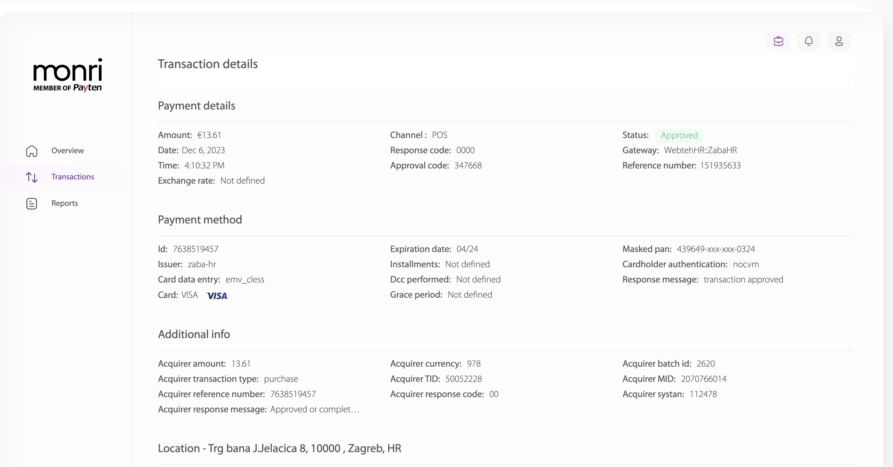
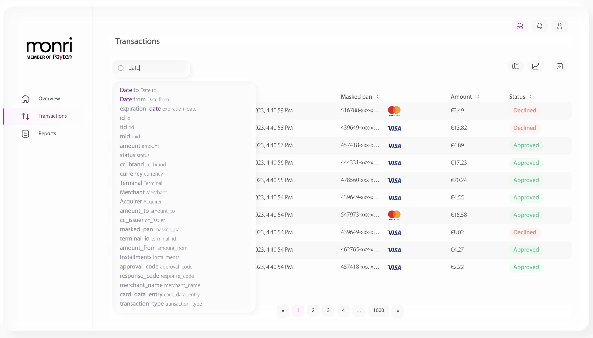

# Transactions

Klikom na Transactions tab u lijevom meniju, otvara se pregled transakcija trgovca.

Atributi transakcija koji su prikazani su:

* _id_ (jedinstveni redni broj transakcije),
* _type_ (tip transakcije),
* _date_ (datum trasnakcije),
* _masked_ pan (maskirni broj kartice),
* _amount_ (iznos transakcije u eurima) te
* _status_ (status transakcije).

<figure><figcaption>
Slika: Prikaz transakcija
</figcaption></figure>

Klikom na id trasnakcije, otvara se detaljni prikaz transkcije, kao što je prikazano na slici ispod.

U detaljnom prikazu transakcije prikazane su informacije o: payment details, payment method, additional info, custom attributes i mapa nastanka transakcije.

<figure><figcaption></figcaption></figure>

 

<figure><figcaption></figcaption></figure>

 

<figure><figcaption></figcaption></figure>

Transakcije se mogu pretraživati koristeći search polje iznad tabelarnog prikaza. Polja po kojima se pretraga može vršiti su: id, tid, mid, amount, status, cc\_brand, cc\_issuer, currency, terminal, merhcant, acquirer, amount\_to, date\_from, date\_to, installments, approval\_code, response\_code, merchant\_name, card\_data\_entry, transaction\_type.

<figure><figcaption>
Slika: Prikaz polja za pretragu transakcije
</figcaption></figure>
