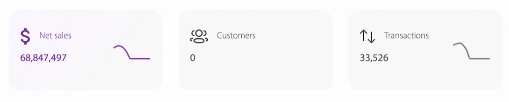
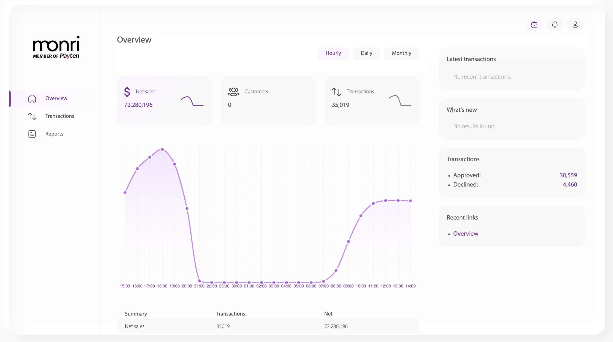

# Overview

Ova stranica predstavlja pregled stanja poslovanja trgovca čiji je uposlenik ulogovani korisnik.

U gornjem desnom uglu nalaze se tri ponuđena perioda, za koje je moguće izračunati i prikazati pregled stanja poslovanja trgovca.

Period se bira od strane korisnika. Ponuđene opcije su:

* _hourly_ (svakog sata zadnja 24 sata),
* _daily_ (svakog dana zadnjih 31 dana) te
* _monthly_ (svakog mjeseca zadnjih 12 mjeseci).

Na slici ispod prikazana su opisana tri perioda. U ovo slučaju odabran je hourly _(označen ljubičastom bojom)_.

<figure><figcaption>
Slika 2: Tri ponuđena perioda pregleda stanja
</figcaption></figure>

U dijelu prozora ispod spomenutih perioda su prikazane tri kartice koje analiziraju stanje poslovanja trgovca. U pitanju su sljedeće vrste analize:

* _Net sales_ (sumu transakcija),
* _Customers_ (broj korisnika) te
* _Transactions_ (broj transakcija) za odabrani period.

<figure><figcaption>
Slika 3: Prikaz tri stanja poslovanja trgovca
</figcaption></figure>

Koristeći kombinacije tri perioda i tri metrike poslovanja trgovca, korisnik može da napravi 9 kombinacija koje mu pružaju uvid u poslovanje. Za svaki period (dnevni, mjesečni i godišnji) može se izvršiti prikaz sume transakcije, broja korisnika te broja transakcija za taj period. Klikom bilo koje od tih 9 kombinacija, vrši se brza kalkulacija i rezultati bivaju prikazani kroz graf na sredini početnog ekrana.&#x20;

U nastavku će biti analizirana i prikazana metrika sume transakcija za sva tri perioda. Preostale dvije metrike se analiziraju na isti način.

* **Suma transakcija na dnevnom nivou**

Nakon klika na NetSales generiše se graf predstavljen na slici niže. Graf se proseže kroz zadnja 24 sata - jer je odabran period _hourly_. Print scr je generisan u 15:40  sati. Prikaz će se generisati od prvog punog prošlog sata, pa unazad 24 sata. Zbog toga je, u ovom slučaju, prva tačka grafa 14:00, a zadnja 13:00.

<figure><figcaption>
Slika 4: Prikaz sume transakcija po dnevnom periodu
</figcaption></figure>

Tačke na grafu prikazuju vrijednosti sume transakcija u zadnjih sat vremena, a kurvatura grafa opisuje trendove i tok sume transakcija za trgovca.

Prikaz na tački se dobiva prelaskom miša preko tačke. Na slici niže, prikazana je tačka koja predstavlja vrijednost sume transakcija nastalih u sat vremena od 10:00 do 11:00 sati.

<figure><figcaption>
Slika 5: Prikaz vrijednosti sume transakcije u jednoj tački na grafu
</figcaption></figure>

* **Suma transakcija na mjesečnom nivou**

<figure><figcaption></figcaption></figure>

* **Suma transakcija na godišnjem nivou**

<figure><figcaption></figcaption></figure>

U desnoj strani prozora vidimo prikaz broja odobrenih i odbijenih transakcija trgovca, koje su izračunate za prethodno odabrani period - u ovom slučaju _hourly_.

<figure><figcaption>
Slika 3: Prikaz izračunatih odobrenih i odbijenih transakcija za odabrani period za trgovca
</figcaption></figure>
